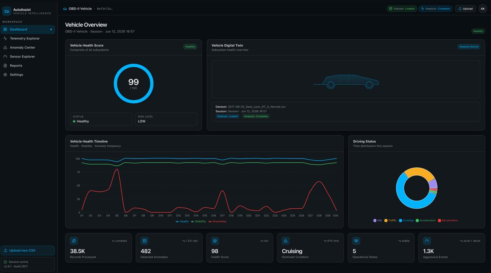
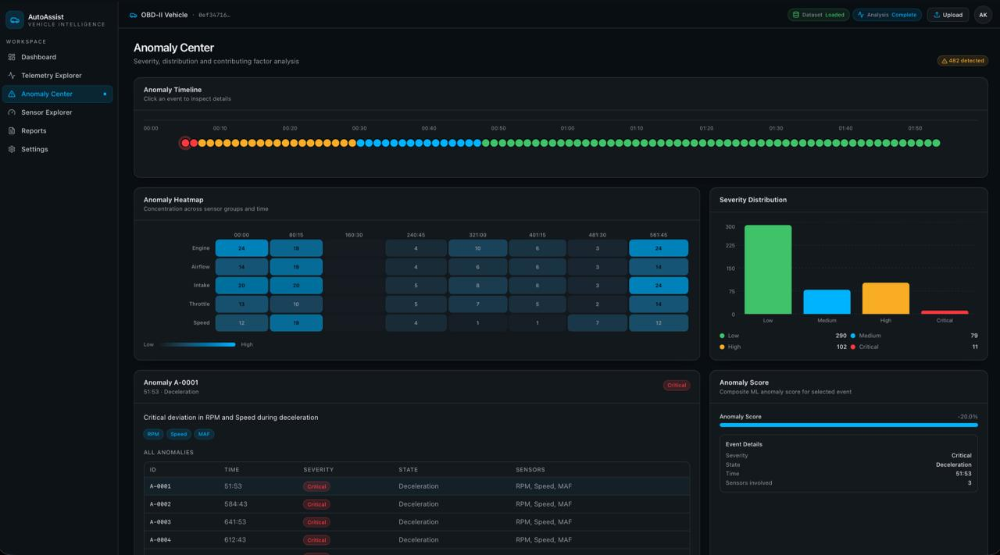
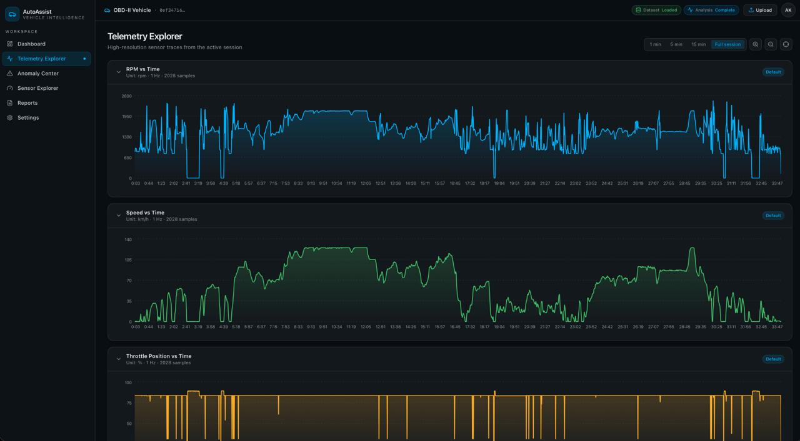
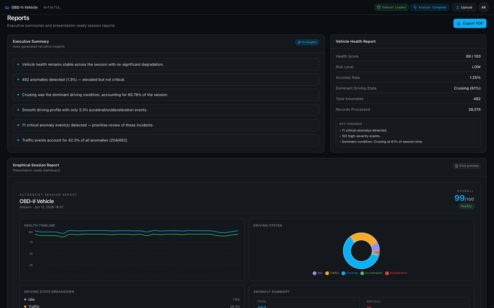

# AutoAssist 🚗

### AI-Powered OBD-II Vehicle Health Monitoring & Anomaly Detection Platform

AutoAssist is an end-to-end vehicle telemetry analytics platform that uses OBD-II sensor data, machine learning, and interactive visualizations to detect abnormal vehicle behavior, assess vehicle health, and provide actionable insights through a modern web dashboard.

The project combines data engineering, anomaly detection, health scoring, backend APIs, and frontend analytics into a complete vehicle monitoring system.

---

## Dashboard Preview

### Dashboard



### Anomaly Center



### Telemetry Explorer



### Reports



---

# Features

## Vehicle Health Monitoring

* Vehicle health score generation
* Risk level classification
* Session-level vehicle assessment
* Health trend analysis

## Anomaly Detection

* Isolation Forest based anomaly detection
* Sensor behavior analysis
* Per-record anomaly scoring
* Binary anomaly classification
* Session anomaly summaries

## Driving State Classification

Automatically classifies telemetry into:

* Idle
* Traffic
* Cruising
* Acceleration
* Deceleration

## Interactive Analytics Dashboard

* Health overview
* Telemetry visualization
* Sensor exploration
* Anomaly investigation
* Session reports
* Correlation analysis

## CSV-Based Workflow

* Upload vehicle telemetry datasets
* Automatic preprocessing
* Feature engineering
* Anomaly analysis
* Health assessment generation

---

# System Architecture

```text
CSV Upload
     │
     ▼
Preprocessing Pipeline
     │
     ▼
State Classification
     │
     ▼
Feature Engineering
     │
     ▼
Isolation Forest Model
     │
     ▼
Anomaly Detection
     │
     ▼
Health Score Engine
     │
     ▼
FastAPI Backend
     │
     ▼
React Dashboard
```

---

# Machine Learning Pipeline

## Feature Engineering

The platform generates engineered features from raw OBD-II telemetry:

* RPM Delta
* Speed Delta
* MAF Delta
* MAP Delta
* Throttle Delta

### Input Features

```text
rpm
speed
maf
map
throttle_pos
rpm_delta
speed_delta
maf_delta
map_delta
throttle_delta
```

---

## Model

Algorithm:

```python
IsolationForest(
    n_estimators=200,
    contamination="auto",
    random_state=42
)
```

### Model Artifacts

```text
models/
├── isolation_forest.pkl
├── scaler.pkl
└── feature_config.json
```

---

# Validation Results

Validation performed on:

```text
2,693,087 telemetry records
```

### Overall Performance

| Metric               | Value     |
| -------------------- | --------- |
| Total Records        | 2,693,087 |
| Total Anomalies      | 82,823    |
| Overall Anomaly Rate | 3.08%     |

### Driving State Analysis

| Driving State | Anomaly Rate |
| ------------- | ------------ |
| Idle          | 2.86%        |
| Traffic       | 2.47%        |
| Cruising      | 2.70%        |
| Acceleration  | 17.81%       |
| Deceleration  | 12.28%       |

### Key Findings

* Acceleration and deceleration states exhibit significantly higher anomaly rates due to transient vehicle dynamics.
* Steady-state driving (traffic, cruising, idle) maintains consistent low anomaly rates.
* The model learned a compact normal driving region with minimal anomaly inflation.

---

# Technology Stack

## Backend

* Python 3.11+
* FastAPI
* Pandas
* NumPy
* Scikit-Learn
* Joblib
* Pydantic

## Frontend

* React
* TypeScript
* TanStack Start
* TanStack Router
* React Query
* Tailwind CSS
* Recharts

## Machine Learning

* Isolation Forest
* StandardScaler
* Custom Feature Engineering Pipeline

---

# Project Structure

```text
OBDAnomalyDetector/
│
├── client/
│   ├── routes/
│   ├── components/
│   ├── hooks/
│   └── api/
│
├── server/
│   ├── preprocessing/
│   ├── analytics/
│   ├── ml/
│   └── api/
│
├── models/
│
├── data/
│
├── reports/
│
├── docs/
│
└── README.md
```

---

# Running Locally

## Clone Repository

```bash
git clone https://github.com/AadilSandeep/OBDAnomalyDetector.git

cd OBDAnomalyDetector
```

---

## Backend Setup

Install dependencies:

```bash
pip install -r requirements.txt
```

Run FastAPI:

```bash
uvicorn server.api.main:app --reload
```

Backend URL:

```text
http://localhost:8000
```

Swagger Documentation:

```text
http://localhost:8000/docs
```

---

## Frontend Setup

```bash
cd client

npm install

npm run dev
```

Frontend URL:

```text
http://localhost:3000
```

---

# Supported Dataset Requirements

The current version expects telemetry containing the following core signals:

```text
RPM
Vehicle Speed
Mass Air Flow (MAF)
Manifold Absolute Pressure (MAP)
Throttle Position
```

Datasets using different column names may require updates to the preprocessing mapping configuration.

---

# Current Limitations

* Requires a supported OBD-II telemetry schema
* Designed for offline CSV analysis
* No direct OBD-II hardware integration yet
* No fault-code (DTC) interpretation
* No real-time telemetry streaming

---

# Future Scope

## Dataset Flexibility

* Automatic schema detection
* Alias-based column mapping
* Support for multiple OBD-II dataset formats

## Real-Time OBD-II Integration

Planned support for:

* ELM327 Bluetooth Dongles
* ELM327 Wi-Fi Dongles
* Live vehicle telemetry streaming

### Future Architecture

```text
Vehicle
    │
    ▼
OBD-II Dongle
    │
    ▼
Live Telemetry Stream
    │
    ▼
AutoAssist
    │
    ▼
Real-Time Health Monitoring
```

## Real-Time Health Monitoring

Future versions aim to provide:

* Live anomaly detection
* Streaming health scores
* Driver alerts
* Continuous health tracking

## Diagnostic Intelligence

Future research direction:

```text
Anomaly Detection
        │
        ▼
Diagnostic Engine
        │
        ▼
Root Cause Suggestions
```

Potential capabilities:

* Airflow anomaly detection
* Sensor drift identification
* Intake system monitoring
* Early fault prediction

---

# Project Status

### Version

```text
v1.0 MVP
```

### Completed

* Data preprocessing pipeline
* Driving state classification
* Feature engineering
* Model training
* Anomaly detection
* Health score engine
* Validation pipeline
* FastAPI backend
* React frontend
* End-to-end CSV analysis workflow

---

# License

This project was developed for academic, research, and educational purposes.

---

# Author

**Aadil Sandeep**

Computer Science Engineering

Vehicle Analytics • Machine Learning • Automotive AI
